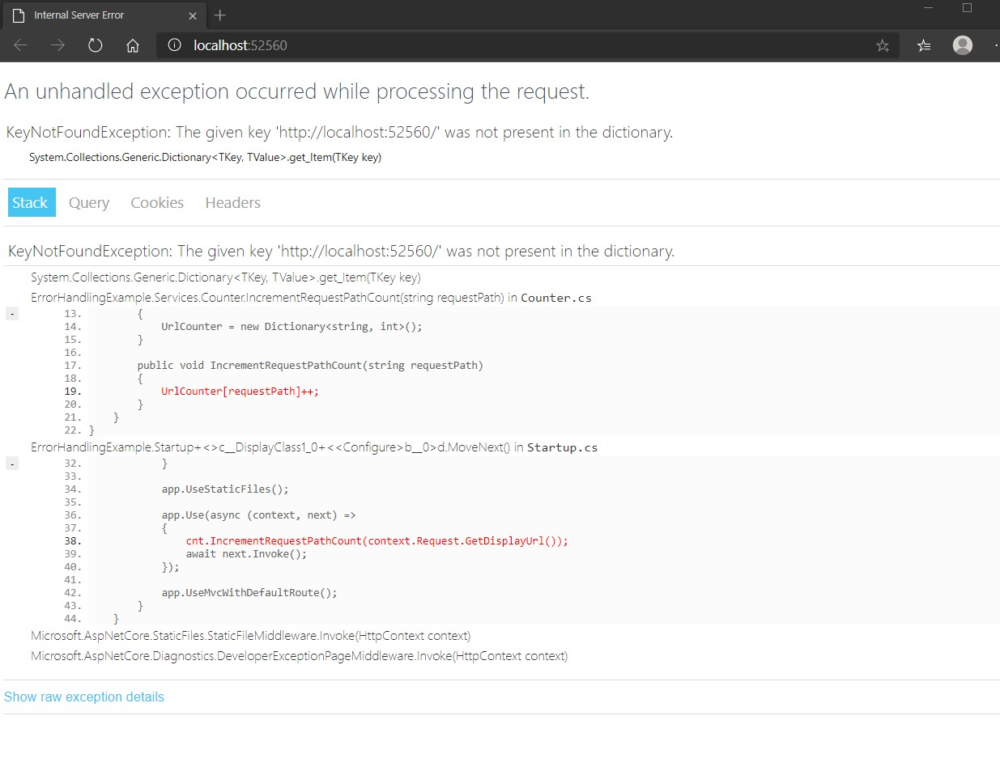
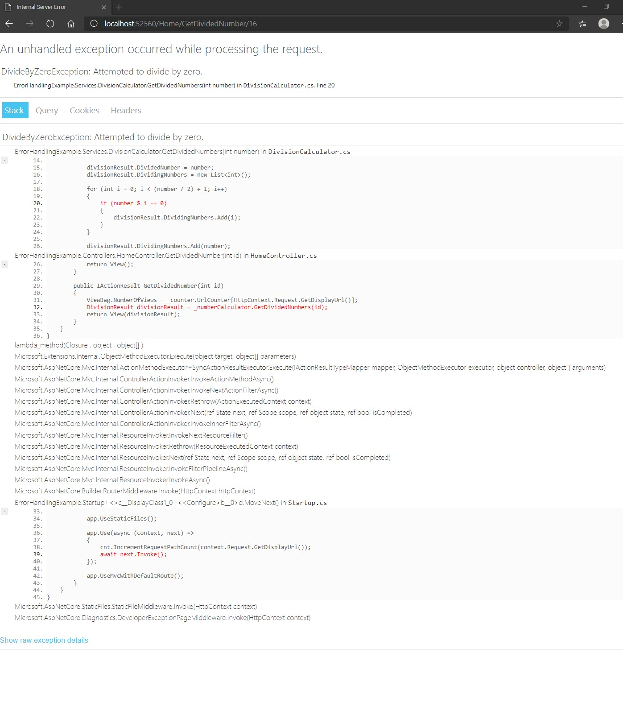
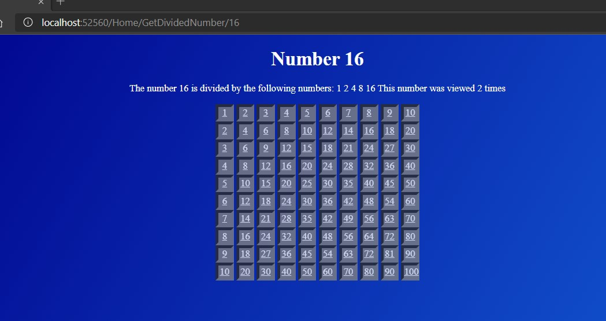

# Tareas del MOC

## Module 10: Testing and Troubleshooting

# Lesson 2: Implementing an Exception Handling Strategy

### Demonstration: How to Configure Exception Handling

- Ejecutamos el proyecto en modo producción y comprobamos que nos da un error

Cambiamos el codigo en la clase **counter** y ejecutamos

En la pantalla pulsamos en el 16 y nos aparece otro error

Cambiamos el codigo en la clase **DivisionCalculator**

y volvemos a ejecutar

